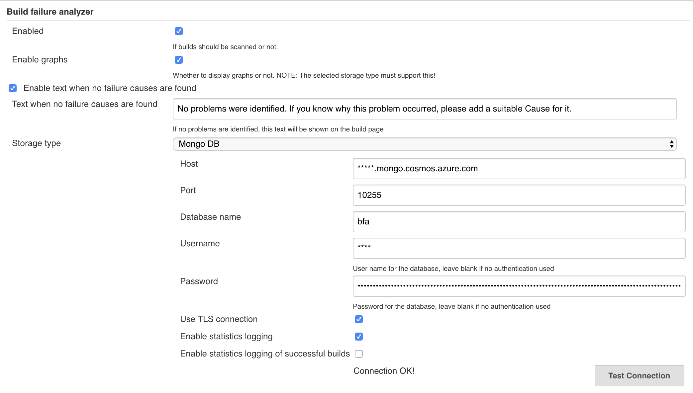

# Azure Cosmos DB

This is a guide for setting up the MongoDB storage with the Azure cloud provider,

## Prerequisites

* a mongodb client, e.g. the mongo shell from the [mongo installation guide](https://docs.mongodb.com/manual/installation/)

## Getting started

1. create the Azure Cosmos DB instance, [follow the Microsoft quickstart](https://docs.microsoft.com/en-us/azure/cosmos-db/create-mongodb-java) for this.
    * you can skip the 'create a collection' step and just create a database for now,
    the plugin will automatically create the collections for you

2. go to the 'Connection string' page on your Cosmos DB resource


## Configuring the plugin via UI

In a separate tab you can now configure the plugin in Jenkins,

* go to https://<YOUR-JENKINS-URL/configure
* scroll down to the build failure analyzer section
* fill it out as per the 'Connection string' page in the Azure portal

It should look roughly like this:



* click test connection, you should see success
* click 'Save'

Skip to the 'Add required index' section

## Configuring the plugin via configuration as code

If you're using the configuration as code plugin, you can use config like this:

```yaml
unclassified:
  buildFailureAnalyzer:
    doNotAnalyzeAbortedJob: true
    gerritTriggerEnabled: false
    globalEnabled: true
    graphsEnabled: true
    knowledgeBase:
      mongoDB:
        dbName: "bfa"
        enableStatistics: true
        host: "<your-cosmos-db-name>.mongo.cosmos.azure.com"
        password: "your password" # see docs for handling secrets https://github.com/jenkinsci/configuration-as-code-plugin/blob/master/docs/features/secrets.adoc
        port: 10255
        successfulLogging: false
        tls: true
        userName: "<your-cosmos-db-name>"
```

## Adding required index

Azure Cosmos DB requires an index when an order by query is performed, in order for this plugin to work you need to run the following commands:

the example uses the mongo shell, but you can use any mongo client (except the one in the Azure portal which doesn't work for this)

```bash
mongo '<primary-connection-string'

use <db-name> # this should be the db name you chose earlier, e.g. bfa
db.failureCauses.createIndex({ "name": 1 })
```

## Configure a failure cause

* go to your jenkins home page
* click 'Failure Cause Management'
* fill out the fields
* click save

Go to the 'Data explorer' Azure, and click '<your-database-name>' and then 'failureCauses'.

You should now see the failure cause you just created.
