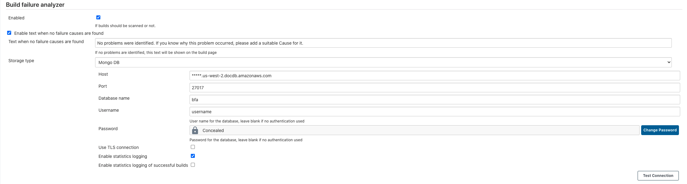

# AWS DocumentDB

This is a guide for setting up the MongoDB storage with the AWS Document DB,

## Prerequisites

* a mongodb client, e.g. the mongo shell from the [mongo installation guide](https://docs.mongodb.com/manual/installation/)

## Getting started

1. Create the DocumentDB cluster in AWS, [follow the AWS DocumentDb quickstart](https://docs.aws.amazon.com/documentdb/latest/developerguide/db-cluster-create.html) for this.
    * the plugin will automatically create the collections for you so no need to create a collection

2. Disable TLS on the cluster by following this step
    * Go to DocumentDB services and click on Parameter Groups
    * Click on create and create a new Parameter Groups. Provide relevant name and description
    * Once created, click on newly created Parameter Groups and select tls. Click on edit button on top
    * Choose value as disable and then click on modify cluster parameter. New cluster parameter group is saved with tls disabled
    * Click on Clusters and select modify in Action dropdown
    * Select your newly created cluster group in Cluster parameter group option and save the cluster. Reboot cluster and associated instance
    
3. Add inbound rule to security group of your cluster to access cluster
    * Create a new inbound rule with following values
        * Type : Custom TCP
        * Protocol : TCP
        * Port Range : 27017
        * Source : IP range of your network

4. Go to Amazon DocumentDB and then go to Clusters. Select the cluster which you have created. Then go to Connectivity & Security tab


## Configuring the plugin via UI

In a separate tab you can now configure the plugin in Jenkins,

* go to https://<YOUR-JENKINS-URL/configure
* scroll down to the build failure analyzer section
* fill it out as per below
    * Get host as mentioned in Connectivity & Security tab
    * Provide port as 27017
    * Update username and password from mastername and masterpassword you have provided during creation

It should look roughly like this:



* click test connection, you should see success
* click 'Save'

## Configuring the plugin via configuration as code

If you're using the configuration as code plugin, you can use config like this:

```yaml
unclassified:
  buildFailureAnalyzer:
    doNotAnalyzeAbortedJob: true
    gerritTriggerEnabled: false
    globalEnabled: true
    graphsEnabled: true
    knowledgeBase:
      mongoDB:
        dbName: "bfa"
        enableStatistics: true
        host: "<your-documentdb-cluseter-name>.us-west-2.docdb.amazonaws.com"
        password: "your documentdb masterpasswrd" # see docs for handling secrets https://github.com/jenkinsci/configuration-as-code-plugin/blob/master/docs/features/secrets.adoc
        port: 27017
        successfulLogging: false
        tls: false
        userName: "<your-documentdb-masterusername>"
```


## Configure a failure cause

* go to your jenkins home page
* click 'Failure Cause Management'
* fill out the fields
* click save

